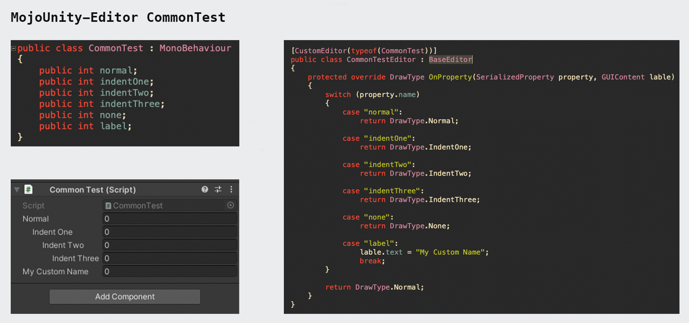
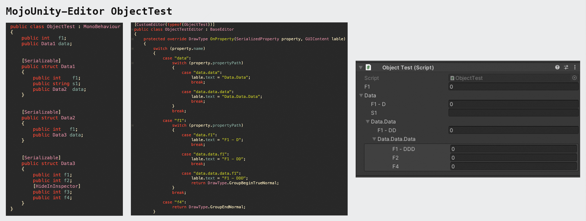

## MojoUnity-Editor v1.0

**MojoUnity-Editor** is an extension of the **UnityEditor**. With **MojoUnity-Editor**, you can **easily** and **quickly** extend the Unity's **Inspector** and **Window**.

* Released version in [releases](https://github.com/scottcgi/MojoUnity-Packages/releases).
* Release changes in [ChangeLog](./ChangeLog.md).

## Features

**MojoUnity-Editor** uses a new way to code Inspector and window, it skips many details to control the format and interaction of properties on GUI.

Sure, using **MojoUnity-Editor**, you can easily build your complex Inspectors or Windows.

The core design is:
* First, build built-in formatting and visibility control, which is **BaseEditor**.
* Second, by inheriting **BaseEditor** to controlling properties implement the logical display and interaction.

The main ways of use are: 

* Use **Switch** to catch the properties that need to be set.
* Use **DrawType** to control properties on Inspector or Window.
* Use **EditorTool** to handle properties in Array or Object.

## Use Cases

## Issues & Discussions

* Any bugs can go to [[MojoUnity-Editor Issues]](https://github.com/scottcgi/MojoUnity-Packages/labels/MojoUnity-Editor) for feedback.
* Any questions or comments can go to [[MojoUnity-Editor Discussions]](https://github.com/scottcgi/MojoUnity-Packages/discussions/categories/mojounity-editor) for exchange.
