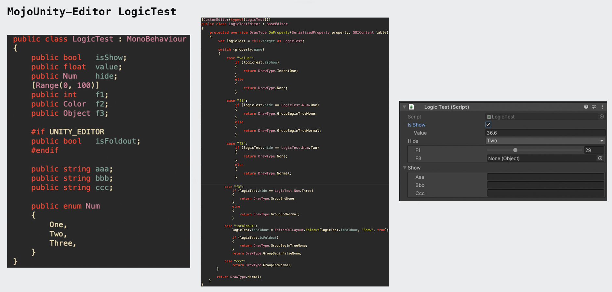
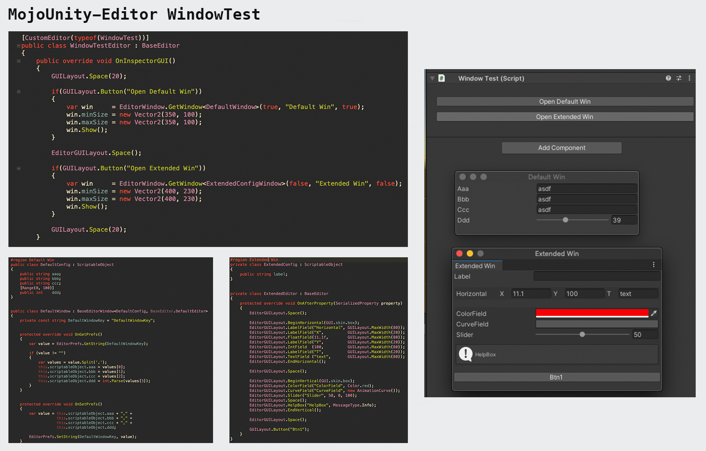

## MojoUnity-Editor v1.0.1

**MojoUnity-Editor** is an extension of the **UnityEditor**. With it, you can **easily** and **quickly** extend the Unity's **Inspector** and **Window**.

* The current `unitypackage`, **packaged** by `Unity-2020.3`, **tested** on `Unity-2017.4`, and **supported** Unity versions are `2017.4 or higher`.  
* Released versions in [releases](https://github.com/scottcgi/MojoUnity-Packages/releases).
* Release changes in [ChangeLog](./ChangeLog.md).

## Note

The C# code used the `interpolated strings` feature, so we need to set the `.net` to **4.x or higher** version. And if the `interpolated strings` is removed then the code can run on the older Unity (such as **5.x**) version.

## Features

**MojoUnity-Editor** uses a new way to code Inspector and Window, it skips many details to control the format and interaction of properties on GUI. You can easily build your complex Inspectors or Windows, with the following features:

* Custom **property** format display.
* Custom **property** logical interaction.
* Custom **Array** or **Object** display and interaction.
* Custom **Group** or **Nested Group** display.
* Custom **Window** display and interaction.
* Custom **Window Data** write and read.

## Use Cases

## Quick Start

1. Open the `MojoUnityEditor Scene` at `/MojoUnity/Samples/MojoUnityEditor/Scenes/MojoUnityEidtor.unity`
1. the `Unity Hierarchy` shows the Samples of `CommonTest`, `GroupTest`, `ArrayTest`, `ObjectTest`, `LogicTest`, `WindowTest`.
1. Click each Samples and see the result in the `Unity Inspector`.
1. View the Samples Code (very simple) at `/MojoUnity/Samples/MojoUnityEditor/Scripts`.

The MojoUnity-Editor source code at `/MojoUnity/Scripts/Editor/BaseEditor`, with good format and comments, you can read or debug to see how it works.

## Issues & Discussions

* Any bugs can go to [[MojoUnity-Editor Issues]](https://github.com/scottcgi/MojoUnity-Packages/labels/MojoUnity-Editor) for feedback.
* Any questions or comments can go to [[MojoUnity-Editor Discussions]](https://github.com/scottcgi/MojoUnity-Packages/discussions/categories/mojounity-editor) for exchange.
