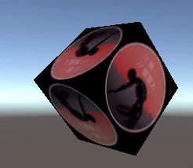
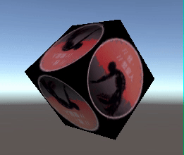
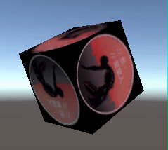

## MojoUnity-Shake v1.0

**MojoUnity-Shake** is a **Animation Tool** that can shake `float` `vector2` `vector3` with realistic effects. It uses `Coroutine` to implement the **Smooth** or **PerlinNoise** algorithm. 

And it provides an extension of `Transform` can easily shake any **Transform Component** (including Camera) by `Position` `Scale` `Rotation`.

* The current `unitypackage`, **packaged** by `Unity-2020.3`, **tested** on `Unity-2018.4`, and **supported** Unity versions are `2018.4 or higher`.  
* Released versions in [releases](https://github.com/scottcgi/MojoUnity-Packages/releases).
* Release changes in [ChangeLog](./ChangeLog.md).

Quick **goto** the [Samples Code](./Src/MojoUnity/Samples/MojoUnityShake/Scripts/) and the [Source Code](./Src/MojoUnity/Scripts/Modules/Animation/Shake/).

## Note

The **source code** depends on the `Burst Package`, which can be found and installed by `Package Manager` in the Unity menu `Window/Package Manager`.

## Features

* Two **efficient** algorithms, silky **realistic** effect.
* Simple **API** easy to use.
* Free extend to shake **anything** you want.
* Using **BurstCompile** to optimize.

## Use Cases

* Shake Transform **Position** XYZ   
  
  
* Shake Transform **Scale** XYZ  
  

* Shake Transform **Rotation** XYZ  
  
  
## Quick Start

1. Open the `MojoUnityShake` Scene in `/MojoUnity/Samples/MojoUnityShake/Scenes/MojoUnityShake.unity`.
2. Click the `Cube` GameObject in `Unity Hierarchy`.
3. Click the `Play` button in `Unity Game Window`.
4. Shake the `Cube` by `ShakeTest` in `Unity Inspector`.  

## Issues & Discussions

* Any bugs can go to [[MojoUnity-Shake Issues]](https://github.com/scottcgi/MojoUnity-Packages/labels/MojoUnity-Shake) for feedback.
* Any questions or comments can go to [[MojoUnity-Shake Discussions]](https://github.com/scottcgi/MojoUnity-Packages/discussions/categories/mojounity-shake) for exchange.
