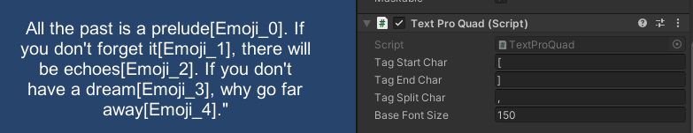
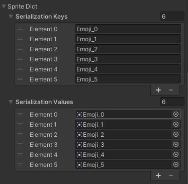
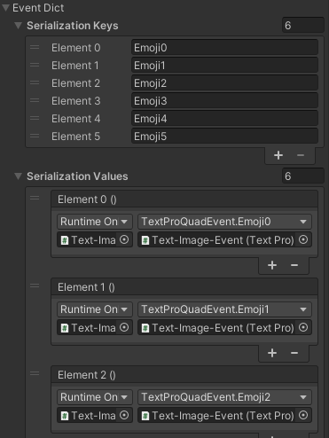

## MojoUnity-TextPro v1.0

**MojoUnity-TextPro** is a **Extension** of **UGUI Text** which can mix **texts** and **images** as well as attach **events**.

* The current `unitypackage`, **packaged** by `Unity-2020.3`, **tested** on `Unity-2018.4`, and **supported** Unity versions are `2018.4 or higher`.  
* Released versions in [releases](https://github.com/scottcgi/MojoUnity-Packages/releases).
* Release changes in [ChangeLog](./ChangeLog.md).

Quick **goto** the [Samples Code](./Src/MojoUnity/Samples/MojoUnityTextPro/Scripts/) and the [Source Code](./Src/MojoUnity/Scripts/Modules/UI).

## Note

The **source code** depends on the `Unity UI`, which can be found and installed by `Package Manager` in the Unity menu `Window/Package Manager`.

## Features

* Mix Text-Image with Event by **Efficient** algorithm.
* Serialize **Image** and **Event** dictionaries in Inspector.
* Custom **Image-Event** tag in Text.
* Simple **API** easy to use.

## Use Cases

* Custom **tag** in Text.  
  
  
* Image **dictionay** in Inspector. 
  

* Event **dictionay** in Inspector.  
  

* Play **Image-Text-Event** in Unity.
  
  
## Quick Start

1. Open the `MojoUnityTextPro` Scene in `/MojoUnity/Samples/MojoUnityTextPro/Scenes/MojoUnityTextPro.unity`.
2. Click the `Text-Image-Event` GameObject, which is child of `Samples` GameObject, in `Unity Hierarchy`.
3. Click the `Play` button in `Unity Game Window`.
4. View the settings of `TextPro` and `TextProQuad` in `Text-Image-Event` GameObject.
5. View the Sample Code in `/MojoUnity/Samples/MojoUnityTextPro/Scripts/TextProQuadEvent.cs`.

Note: If the `image tag` is not replaced correctly in PlayMode, please check whether the `Serialization Dict` setting is right in `Inspector`.

## Issues & Discussions

* Any bugs can go to [[MojoUnity-TextPro Issues]](https://github.com/scottcgi/MojoUnity-Packages/labels/MojoUnity-TextPro) for feedback.
* Any questions or comments can go to [[MojoUnity-TextPro Discussions]](https://github.com/scottcgi/MojoUnity-Packages/discussions/categories/mojounity-textpro) for exchange.
